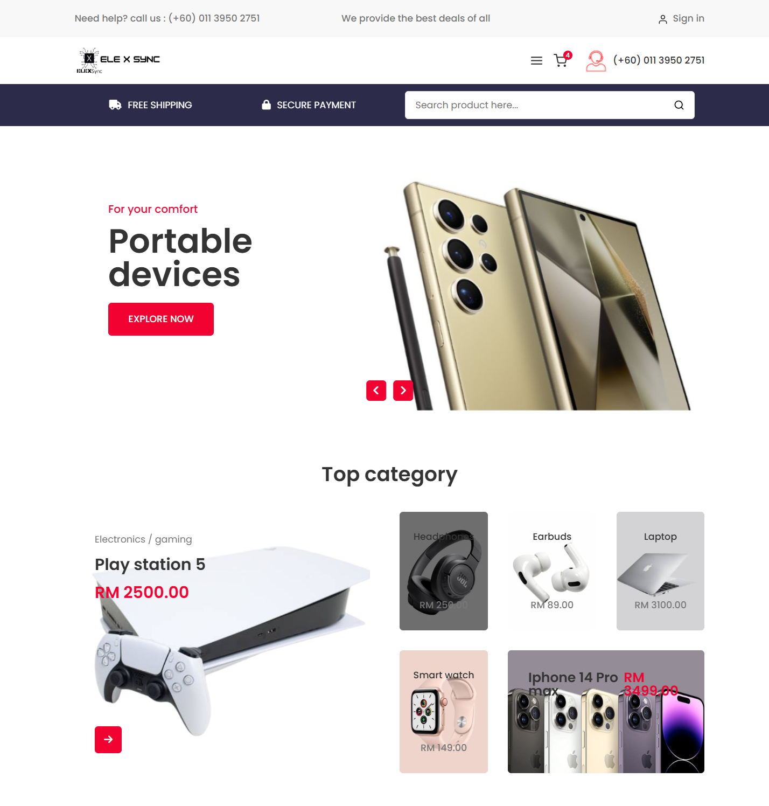

<h1 align="center" style="font-weight: bold;">ElexSync: Electronics & Gadgets eCommerce Website 🛍️</h1>

<p align="center">
<a href="#technologies">Technologies</a>
    <span>&nbsp; • &nbsp;</span>
<a href="#started">Getting Started</a>
    <span>&nbsp; • &nbsp;</span>
<a href="#team">Team Members</a>
</p>

<p align="center">ElexSync is an e-commerce platform for purchasing the latest gadgets with a seamless user experience.</p>

<p align="center">
🚀 Currently available on localhost only.
</p>

<h2 id="layout">🎨 Layout</h2>

<p align="center">

</p>

<h2 id="technologies">💻 Technologies</h2>

### Frontend:
- HTML
- CSS
- Bootstrap
- JavaScript

### Backend:
- Apache Tomcat
- JSP (Java Server Pages)
- Java

### Suggested IDE
- IntelliJ IDEA Ultimate

<h2 id="started">🚀 Getting Started</h2>

Follow these steps to set up and run ElexSync locally.

<h3>Prerequisites</h3>

Ensure you have the following installed:

- [Apache Tomcat](https://tomcat.apache.org/)
- [Java JDK](https://www.oracle.com/java/technologies/javase-downloads.html)
- [Git](https://git-scm.com/)

<h3>Cloning</h3>

Clone the project repository:

```bash
git clone https://github.com/Some0ne11/ElexSync.git
```

<h3>Starting</h3>

1. Move the project to your Tomcat `webapps` directory.
2. Start the Tomcat server.
3. Access the project at `http://localhost:8080/`.

<h2 id="team">🤝 Team Members</h2>

<p>Special thanks to all contributors of this project.</p>
<table>
<tr>

<td align="center">
<a href="https://github.com/Some0ne11">
<br>
<sub>
<b>Danial</b>
</sub>
</a>
</td>

<td align="center">
<a href="https://github.com/asyrafmika">
<br>
<sub>
<b>Asyraf</b>
</sub>
</a>
</td>

<td align="center">
<a href="https://github.com/lookman04">
<br>
<sub>
<b>Luqman</b>
</sub>
</a>
</td>

<td align="center">
<a href="https://github.com/arqriz">
<br>
<sub>
<b>Luqman</b>
</sub>
</a>
</td>

</tr>
</table>
